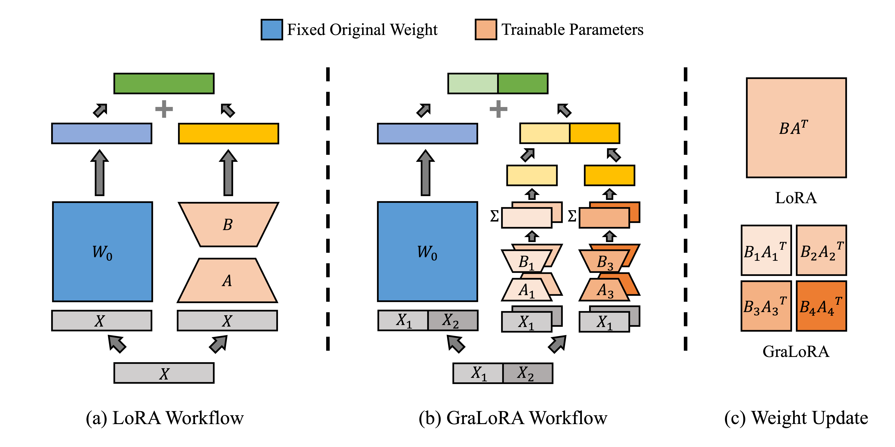
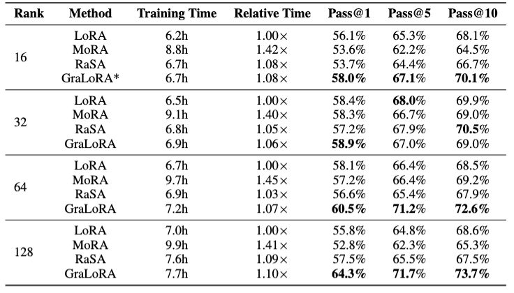

#  GraLoRA: Granular Low-Rank Adaptation for Parameter-Efficient Fine-Tuning

This repository contains the official implementation of **GraLoRA**.



---

## Environment Setup

To install the required dependencies:

```bash
conda create -n gralora python=3.10 -y
conda activate gralora
pip3 install -r requirements.txt
pip3 install -r additional_requirements.txt
pip3 install -e ./peft --config-settings editable_mode=compat
pip3 install -e ./lm-evaluation-harness --config-settings editable_mode=compat
pip3 install -e ./bigcode-evaluation-harness --config-settings editable_mode=compat
```
For a stable setup, it is recommended to work on top of the `nvcr.io/nvidia/cuda:12.1.0-cudnn8-devel-ubuntu22.04` Docker image.

---

## Download Datasets

### Training Datasets

1. **Code Generation Training Dataset**
    ```bash
    python3 scripts/tools/dl_dataset.py ise-uiuc/Magicoder-Evol-Instruct-110K data/ise-uiuc/Magicoder-Evol-Instruct-110K
    ```

2. **Commonsense Reasoning Training Dataset**
    ```bash
    python3 scripts/tools/dl_dataset.py zwhe99/commonsense_170k data/zwhe99/commonsense_170k
    ```

### Evaluation Datasets

1. **Code Generation**: This dataset is automatically downloaded when running the evaluation script.

2. **Commonsense Reasoning**:  
   Download manually from [LLM-Adapters Dataset](https://github.com/AGI-Edgerunners/LLM-Adapters/tree/main/dataset)  
   and store the dataset in `./data/`.

---

## Training Scripts

Training scripts for all main experiments are available in `./scripts/train`.

To reproduce a specific experiment, run:

```bash
./scripts/train/target_train_script.sh
```

We provide separate scripts for each task. While their behavior is nearly identical, the **instruction formats** for Alpaca-chat differ slightly. We adopted the chat formats used by the original repositories:  
- [RaSA](https://github.com/zwhe99/RaSA) for Code Generation  
- [LLM-Adapters](https://github.com/AGI-Edgerunners/LLM-Adapters) for Commonsense Reasoning

---

## Evaluation Scripts

Evaluation scripts for all tasks are located in `./scripts/eval`.

To run an evaluation:

```bash
./scripts/eval/target_eval_script.sh
```

### Code Generation

#### 1. Generate Responses

```bash
EXP_DIR=path_to_this_experiment
python3 code_evaluation.py \
    --model $PATH_TO_BASE_MODEL \
    --peft_model $PATH_TO_PEFT_MODEL \
    --tasks humanevalsynthesize-python \
    --prompt alpaca-chat \
    --do_sample True \
    --temperature 0.2 \
    --n_samples 50 \
    --batch_size 20 \
    --max_length 2048 \
    --allow_code_execution \
    --precision bf16 \
    --metric_output_path $EXP_DIR/metric_output_path.json \
    --save_generations \
    --save_generations_path $EXP_DIR/save_generations_path.json \
    --generation_only
```

#### 2. Compute pass@1, pass@5, and pass@10

```bash
python3 code_evaluation.py \
    --tasks humanevalplus \
    --n_samples 50 \
    --num_workers 48 \
    --timeout 20 \
    --k 1 5 10 \
    --allow_code_execution \
    --metric_output_path $EXP_DIR/metric_output_path.json \
    --load_generations_path $EXP_DIR/save_generations_path_humanevalsynthesize-python.json \
    --results_path $EXP_DIR/results.json
```

The final result will be saved at `EXP_DIR/results.json`.

---

### Commonsense Reasoning

```bash
EXP_DIR=path_to_this_experiment
TASK_NAME=target_task_name
python3 commonsense_evaluate.py \
    --base_model $PATH_TO_BASE_MODEL \
    --peft_model $PATH_TO_PEFT_MODEL \
    --dataset $TASK_NAME \
    --bf16 | tee -a ${EXP_DIR}/${TASK_NAME}.txt
```

The final result will be saved at `EXP_DIR/${TASK_NAME}.txt`.

---

## Results

GraLoRA achieves superior performance on the HumanEval+ task:




## 🤝 Acknowledgements

This work builds upon the contributions of the following repositories:

- [PEFT (Hugging Face)](https://github.com/huggingface/peft)
- [LLM-Adapters](https://github.com/AGI-Edgerunners/LLM-Adapters)
- [RaSA](https://github.com/zwhe99/RaSA)
